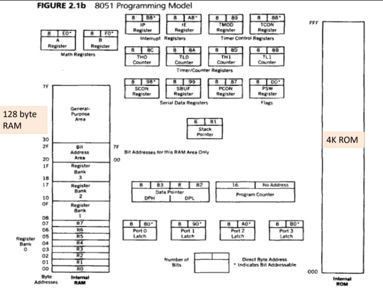
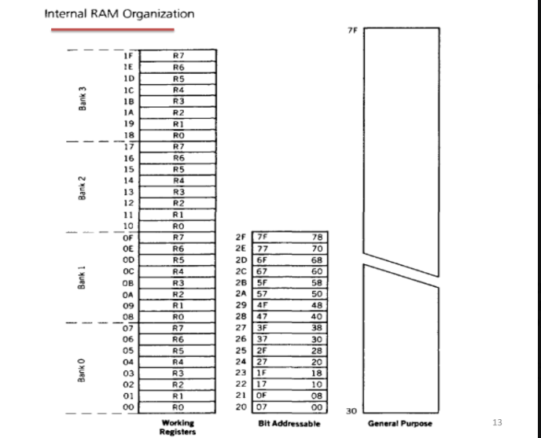

# Notes
`00H` – `1FH`  → 4 register banks  
`20H` – `2FH`  → bit addressable area  
`30H` – `7FH`  → general purpose RAM 

--- 
### 8051 Programming model

  
 
Learn the Internal ram locations and the ones below  
`PSW` - flags  
`TMOD`/`TCON` - Timers  
`SCON`/`SBUF` - Serial port  
`IE`/`IP` - Interrupts  
`SP` - Stack pointer  
`DPTR` - External memory access  

---
### Internal RAM organisation  



`Register Banks` - There are 4 Register banks(Bank 0-3) that can be  controlled by `PSW`s `RS1` - `RS0` bit They are not special and are like general  purpose area/ram but we dont need to call them using their addresses.  

`Bit addressible` - It's just 16 bytes of RAM where you can access individual bits. Normally in RAM you read/write a full byte at a time. But in this area you can do things like:
```
SETB 25H  ; sets bit 25H to 1
CLR 20H   ; clears bit 20H to 0
```
This is super useful for flags, LED on/off, switch status etc. That's literally all you need to know about it conceptually.

`General purpose area` - General purpose RAM (30H–7FH),It's just 80 bytes of plain memory. Store whatever data you want here. No special rules. Its like a notepad — you write data, read it back, etc ..

---


