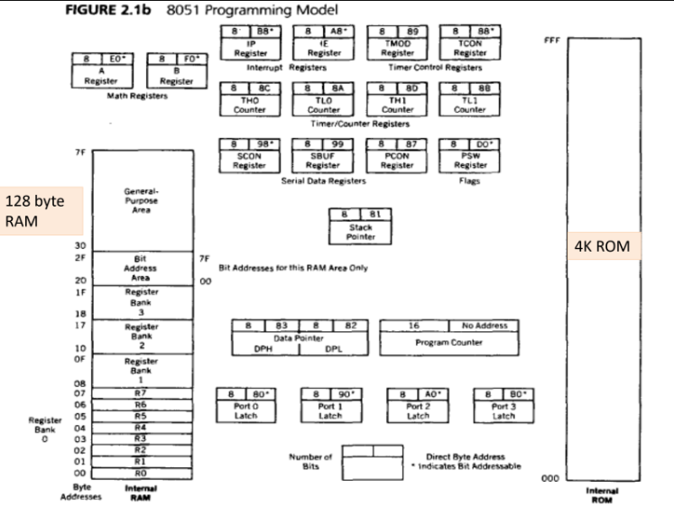
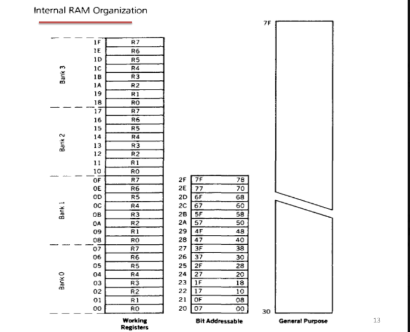

# Notes
`00H` – `1FH`  → 4 register banks  
`20H` – `2FH`  → bit addressable area  
`30H` – `7FH`  → general purpose RAM 

--- 
### 8051 Programming model

  
 
Learn the Internal ram locations and the ones below  
`PSW` - flags  
`TMOD`/`TCON` - Timers  
`SCON`/`SBUF` - Serial port  
`IE`/`IP` - Interrupts  
`SP` - Stack pointer  
`DPTR` - External memory access  

---
### Internal RAM organisation  



`Register Banks` - There are 4 Register banks(Bank 0-3) that can be  controlled by `PSW`s `RS1` - `RS0` bit They are not special and are like general  purpose area/ram but we dont need to call them using their addresses.  

`Bit addressible` - It's just 16 bytes of RAM where you can access individual bits. Normally in RAM you read/write a full byte at a time. But in this area you can do things like:
```
SETB 25H  ; sets bit 25H to 1
CLR 20H   ; clears bit 20H to 0
```
This is super useful for flags, LED on/off, switch status etc. That's literally all you need to know about it conceptually.

`General purpose area` - General purpose RAM (30H–7FH),It's just 80 bytes of plain memory. Store whatever data you want here. No special rules. Its like a notepad — you write data, read it back, etc ..

---

### Importanat SFR addresses

```
ACC       - E0H  
B         - F0H  
PORT 0    - 80H  
PORT 1    - 90H   
PORT 2    - A0H   
PORT 3    - B0H   
R0 BANK 0 - 00H
R1 BANK 0 - 01H  
R1 BANK 1 - 09H
```  
---

### Fullforms
```
A    - Accumulator
B    - Math register
PSW  - Program status word(Flags)
SP   - Stack pointer
DPTR - Data pointer
P0-3 - I/O ports
TMOD - Timer mode control
TCON - Timer control
SCON - Serial control
SBUF - Serial data buffer
IE   - Interrupt enable
IP   - Interrupt priority
PCON - Power control
```
---
### PSW structure and bits

`CY | AC | F0 | RS1 | RS0 | OV | -- | P`

```
CY  - carry flag
AC  - auxillary carry from bit 3 to 4 used in BCD
F0  - Flag 0, user defined
RS1 - Register bank selecter flag
RS0 - Register bank selecter flag
OV  - Overflow flag
-   - ignore
P   - Parity flag(1 if odd no.of 1s in accumulator)
```

| BANKS      | RS1          | RS0         |
|:-----------|:------------:|------------:|
| 0          | 0            | 0           |
| 1          | 0            | 1           |
| 2          | 1            |  0          |
| 3          | 1            | 1           |
---
### Addressing modes
-> Immediate addressing mode   
-> Register addressing mode   
-> Direct addressing mode  
-> Indirect addressing mode  
-> Indexed addressing mode  
-> Stack addressing mode  

#### Immediate addressing mode
```asm
MOV Rr, #n ; Copy 8 bit number n into Rr
MOV A, #n ; Copy 8 bit number n into A
MOV DPTR, #n ; Copy 16 bit number n into DPTR
```
#### Register addressing mode
```asm
MOV Rr, A ; Copy data from A to Rr
MOV A, Rr ; Copy data from Rr to A
```
The size of Rr and A must be equal for this to work  
MOV DPTR, A  ; ❌️  
MOV R7, DPH  ; ✅

#### Direct addressing mode
```asm
MOV Rr, add ; add is address
MOV add, Rr
MOV add, #n
MOV add1, add2
```
`#50H` is a quantity while `50H` is an address  
if we do:
`MOV R6, 50H` the value stored in `50H` gets   transferred to `R6`

#### Indirect addressing mode

```asm
MOV @Rp, #n
MOV @Rp, add
MOV @Rp, A
MOV add, @Rp
MOV A, @Rp
```
`@` only works for specific registers that are in the register banks and  
at`DPTR` register. `@` only used in registers who have literals stored  
but they are actually addresses.

#### Stack addressing mode
```asm
PUSH 05 ; Push value from R5 to stack
POP 05  ; Pop value from stack to R5
```
#### Indexed addressing mode
idk what this is gang

### Assembly instructions
#### MOV
* Destination cannot be immediate data
```
MOV A. #5 ; ✅
MOV #5, A ; ❌️
```
* All numbers must start with 0-9
```
MOV A. #25H ; ✅
MOV A. #0FFH ; ✅
MOV A, #FFH ; ❌️
```
* Register - register moves using register addressing: R0-7 and A
```
MOV R0, A ; ✅
MOV A, R0 ; ✅
MOV R0, R1 ; ❌️
```
* Invlaid address above 7FH
```
MOV A, 30H ; ✅
MOV A, 80H ; ❌️
```
Why?: As said above we know that after `7FH` is for SFR
* Data transfer to ports smt smt  
idk what this is legit

* No data transfer from direct address to itself
MOV 30H, 30H

#### MOVX
* External RAM or I/O addressses (Sometimes they also wire external devices (like sensors or screens) so they act like memory addresses—this is called memory-mapped I/O)
* Indirect addressing is used here always
* All external data moves involve accumulator
* 
```
MOVX @DPTR, A
MOVX @R0, A
MOVX A, @R1
MOVX A, @DPTR
```

* Pointing registers can have this much data:
R0,R1 : `00H` - `FFH` (256 bytes) - `2^8`   
DPTR : `0000H` - `FFFFH` (64K bytes) - `2^16`

The Pointing Registers are used  
Because external memory is huge (up to 64KB), an 8-bit register cannot hold the whole address. You have two options for pointing:

**DPTR** (Data Pointer): This is your heavy-duty, 16-bit pointer. Because it is 16 bits wide, it can hold any address from 0000H to FFFFH. This is the most common way to use MOVX because it gives you access to the entire 64KB of external space.

**R0 and R1**: These are only 8-bit registers. They can only hold addresses from 00H to FFH (256 bytes). This is called "paged" memory access. It is used when you have a very small external RAM chip and want to save code space, as 8-bit pointers process slightly faster than the 16-bit DPTR

#### MOVC 
* Can be used with internal or external ROM to A
* Indirect addressing is used here always
* Destination is always A
* Register A in conjunction with DPTR or PC(only these can be used with A, here)
* PC is incremented at this instruction(has more to it, and didnt understand..)
```asm
MOVC A, @A+DPTR
MOVC A, @A+PC
```
* Example code:
```asm
MOV DPTR, #1234H
MOV A, #03H
MOVC A, @A+DPTR
MOVC A, @A+PC
```
why is `+` used here like this?: `DPTR` points to the starting address in the memory and the `A` is what acts like an index to the memory.
eg: 
| ADDRESS      | DATA         |
|:-------------|:------------:|
| 1234H        | 11           |
| 1235H        | 22           |
| 1236H        | 33           |
| 1237H        | 44           |

when i do `MOVC A, @A+DPTR` we go to the address `(1234+3)H` that is `1237H`
where `44` data is stored


### Instructions affecting flag
`ADD`    
`ADDC`    
`SUBB`    
`MUL`    
`DIV`    
`ANL C, direct`    
`ORL C, direct`    
`MOV C, direct`   
`CLR C`    
`CPL C`   
`DA A`    
`RLC`  not sure about this     
`RRC`  not sure about this   
`CJNE`    
`SETB C` not sure about this     